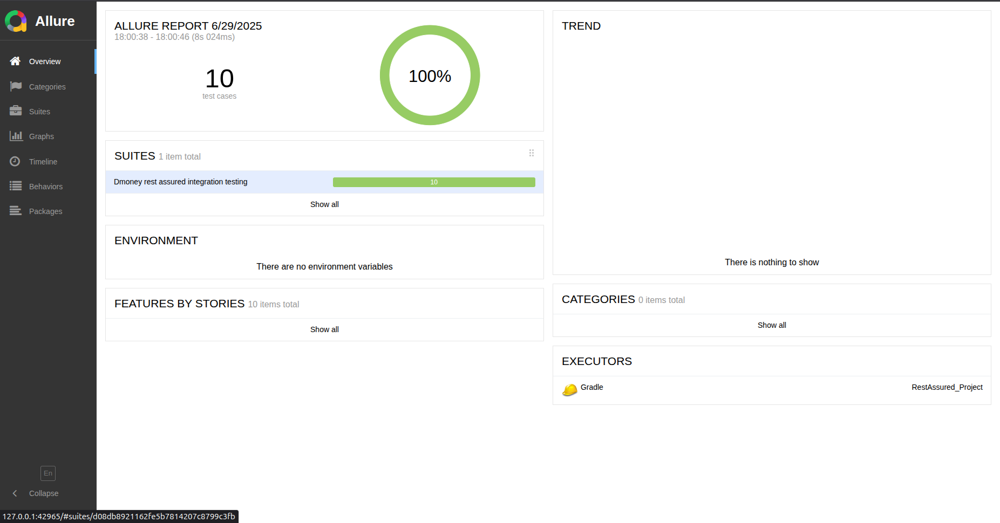
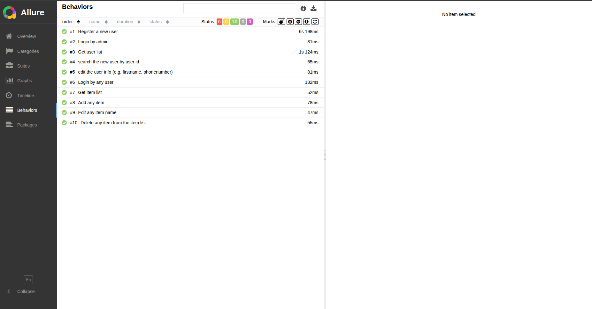

# dailyfinance-api-automation

This project automates the testing of the [DailyFinance](https://dailyfinance.roadtocareer.net/) web application APIs using:

-  **Rest Assured** for HTTP request automation
-  **TestNG** as the testing framework
-  **Gradle** for build management
-  **Allure** for rich and interactive test reporting
-  **POM (Page Object Model)** architecture for maintainable test code

It covers essential user and item-related endpoints including registration, login, item management, and admin operations.

##  Project Structure

```
dailyfinance-api-automation/
├── build.gradle
├── settings.gradle
├── gradlew
├── gradlew.bat
├── .gitignore
├── README.md
├── images/                        # Contains Allure report screenshots
├── src/
│   └── test/
│       ├── java/
│       │   ├── config/
│       │   │   ├── ItemModel.java     # POJO for item API payload
│       │   │   ├── Setup.java         # Loads config.properties
│       │   │   └── UserModel.java     # POJO for user API payload
│       │   ├── controller/
│       │   │   └── UserController.java # All API actions (register, login, etc.)
│       │   ├── testrunner/
│       │   │   └── UserTestRunner.java # All test cases with TestNG
│       │   └── utils/
│       │       └── Utils.java          # Random number generator, setEnvVar
│       └── resources/
│           ├── config.properties       # Stores tokens, IDs, and credentials
│           └── suite.xml              # TestNG suite file

```


##  Tech Stack

| Tool / Framework | Purpose |
|------------------|---------|
| **Java 11+**     | Programming language |
| **Gradle**       | Build tool and dependency management |
| **Rest Assured** | HTTP client for API automation |
| **TestNG**       | Test runner and assertions |
| **Allure**       | Test reporting and visualization |
| **Faker**        | Generating random fake user data |
| **Jackson**      | Object-to-JSON serialization |
| **Lombok**       | (Optional) Boilerplate code reduction |

## Features Covered

The following API functionalities are tested end-to-end using data-driven and dynamic validation:

### User Module

- Register a new user
- Login with valid credentials
- Search user by ID (admin only)
- Edit user information (admin only)
- Get full user list (admin only)

### Item Module

- Add a new item
- Get list of all items (user-specific)
- Edit an item (e.g. change name)
- Delete an existing item

### Admin Access

- Admin login for secure actions (user management)
- Token-based authentication for protected routes

## How to Run the Tests

### Pre-requisites

- Java 11 or higher
- Gradle installed (or use the included `gradlew` script)
- Allure CLI installed (Ubuntu):
  
```bash
sudo apt-add-repository ppa:qameta/allure
sudo apt-get update
sudo apt-get install allure
```

## Run the Tests

To execute all test cases, run the following command:

```bash
gradle clean test
```

This command will run all test methods defined in the TestNG suite file:

```bash
src/test/resources/suite.xml
```

The test results will be stored in:

```bash
build/allure-results/
```

## Generate and View Allure Report

To generate and launch the Allure report in your browser, run:

```bash
allure serve build/allure-results
```

If the browser doesn't open automatically, you can alternatively run:
```bash
allure generate build/allure-results --clean -o build/allure-report
xdg-open build/allure-report/index.html
```

## Test Case Documentation

All test cases are written in a structured **Google Sheet** using standard test case format.

**Test Case Document:** 

[View Test Case Sheet](https://docs.google.com/spreadsheets/d/1QmMW_1omvrQZER3pNb7dMpgAvi2Csr9dtKQpYcA3zvM/edit?usp=sharing)

## Report

### Allure Report

All test cases generate visual test reports using **Allure**.

**Allure Report Overview:**



**Allure Behaviour:**



### Gradle
~[Gradle](images/gradle.png)
